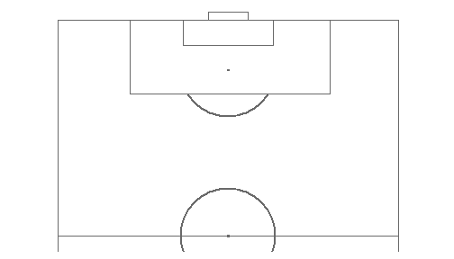
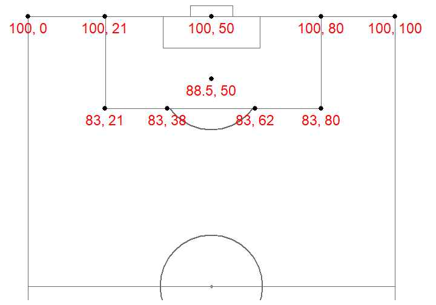

Visualizing the World Cup with R!
========================================================
author: Ryo Nakagawara
date: July 15th, 2018
autosize: true

<style>
.small-code pre code {
  font-size: 1em;
}


.midcenter {
    position: fixed;
    top: 50%;
    left: 50%;
}

img.animated-gif{
  width: 1020px;
  height: auto;
}

img.anim-gif{
  width: 600px;
  height: auto;
}

</style>


About Me
========================================================

<font size = "16">
Ryo Nakagawara
</font>

<font size = "14">
- Education: Chapman University, University College London
- Psychology, Economics
- Work: Data Analytics and Viz Consultant @ ACDI/VOCA
- Interests: Soccer/Football/Fútbol

</font>

Agenda:
========================================================
- Group Tables on the Final Matchday
- Recreating Goals with `ggsoccer` and `ggplot2`
- Animating the Goals of the World Cup!
- Explore Japan's World Cup history through their team uniforms

<center>

</center>

========================================================
<center>


</center>

FIFA World Cup: 2018 (Russia):
========================================================
- 32 national teams from all 5 continents
- Group stage and Knock-out rounds
- 8 groups of 4 teams each
- 3 pts = WIN, 1 pts = DRAW, 0 pts = LOSS
- Last pair of games for each group happen at the same time!
<center>

</center>


========================================================
<center>

</center>

Find ISO codes with the `countrycode` package!
========================================================
class: small-code

- `countrycode` package by [Vincent Arel-Bundock](https://github.com/vincentarelbundock/countrycode)


```r
library(countrycode)

group_d <- group_d %>% 
  gather(team, position, -time) %>% 
  mutate(
    team = as.factor(team),
    team = fct_relevel(team, 
                       "croatia", "nigeria", "argentina", "iceland"),
    flag = team %>% 
      countrycode::countrycode(., origin = "country.name", destination = "iso2c"))

glimpse(group_d)
```

```
Observations: 28
Variables: 4
$ time     <dbl> 1, 2, 3, 4, 5, 6, 7, 1, 2, 3, 4, 5, 6, 7, 1, 2, 3, 4,...
$ team     <fct> croatia, croatia, croatia, croatia, croatia, croatia,...
$ position <dbl> 1, 1, 1, 1, 1, 1, 1, 2, 3, 2, 2, 2, 3, 3, 3, 4, 3, 4,...
$ flag     <chr> "HR", "HR", "HR", "HR", "HR", "HR", "HR", "NG", "NG",...
```

Official World Cup 2018 font: "Dusha"!
========================================================

- Download and install the `.TFF` file
- Use the `extrafont` package to use custom fonts in R!


```r
# import font files in your computer
font_import()  
# install any new font files added to your computer
font_install() 

# run every new session once!
loadfonts()    
# Check out what fonts are ready for use in R!
fonts()        
```
<center>

</center>

Labels...
========================================================

<font size = "15">

```r
country_labs <- data.frame(
  x = c(rep(1, 4)),
  y = c(rep(1:4, 1)),
  country = c("Croatia", "Nigeria", "Iceland", "Argentina")
)
```


```r
x_labs <- c("0'", "14'", "51'", "53'", "76'", "86'", "Full Time")
y_labs <- c("1st", "2nd", "3rd", "4th")
```

</font>

More labels...
========================================================


```r
score_labs <- data.frame(
  x = c(2, 3, 4, 5, 6, 
        7, 7, 7, 7),    
  y = c(2, 2, 4, 3, 2, 
        1, 2, 3, 4),
  score = c("1-0", "1-1", "0-1", "1-1", "2-1", 
            "2-1", "2-1", "1-2", "1-2")  
)
```


```r
goals_labs <- data.frame(
  x = c(2, 3, 4, 5, 6, 7),
  y = c(2, 2, 4, 3, 2, 1),
  scorers = c(
    "Messi", "Moses (pen.)", "(Croatia)\nBadelj", 
    "G. Sigurdsson (pen.)", "Rojo", "Perisic (90')")
)
```

Potential package...?
========================================================
<font size = "15">
- Liable to make a typo
<p>
- Need to brainstorm how to turn into a series of functions... a R package!
<p>
- For now, this "template" will have to do.
</font>


Exciting!
========================================================

<center>

</center>

... boring ...
========================================================

<center>

</center>

Recreating the goals of the World Cup!
========================================================
class: small-code
- `ggsoccer` package by [Ben Torvaney](https://github.com/Torvaney/ggsoccer)

<center>

```r
library(ggplot2)
library(ggsoccer)
data <- data.frame(x = 1, y = 1)

ggplot(data) +
  annotate_pitch() +
  theme_pitch() +
  coord_flip(xlim = c(49, 101),
             ylim = c(-1, 101))
```


</center>

Finding data
========================================================

- Sports  data companies? OPTA?
- More a problem of access rather than availability!


<center>

</center>


ggsoccer coordinate positions
========================================================

<center>

</center>

What some of the data frames look like...
========================================================
class: small-code

```r
# Cristiano's Hat trick
goals_data <- 
  data.frame(
    x = c(88, 80, 71),
    y = c(50, 48, 54),
    label = c(1, 2, 3))

curve_data <- 
  data.frame(
    x = c(88, 71), y = c(50, 54),
    xend = c(100, 100), yend = c(54, 54))

# Gazinsky's opening goal
pass_data <- data.frame(x = c( 84, 82),
                        y = c(  6, 32),
                        x2 = c(77, 84),
                        y2 = c(13, 8))

curve_data <- data.frame(x = c(100, 76),
                         y = c(0, 19),
                         x2 = c(94, 94),
                         y2 = c(35, 60))
```


========================================================
class: small-code


```r
ggplot(goals_data) +
  annotate_pitch() +
  theme_pitch() +
  theme(text = element_text(family = "Dusha V5"),
        legend.position = "none") +
  coord_flip(xlim = c(55, 112),
             ylim = c(-1, 101)) +
  geom_segment(x = 80, y = 48, 
               xend = 97, yend = 48) +  
  geom_segment(x = 97, y = 48, 
               xend = 100, yend = 45.5,
               arrow = arrow(length = unit(0.25, "cm"),
                             type = "closed")) +        
  geom_curve(data = curve_data,
             aes(x = x, y = y, 
                 xend = xend, yend = yend),    
             curvature = 0.3, 
             arrow = arrow(length = unit(0.25, "cm"), type = "closed")) +
  geom_text(data = annotation_data,
            family = "Dusha V5", 
            aes(x = x, y = y,
                hjust = hjust, label = label), 
            size = c(6.5, 4.5, 3, 3.5, 3.5, 3.5)) +
  geom_flag(data = flag_data,
            aes(x = x, y = y,
                image = image), size = c(0.08, 0.08)) +      
  ggimage::geom_emoji(aes(x = 105, 
                 y = c(45, 50, 55)),
             image = "26bd", size = 0.035) +
  geom_point(aes(x = x, y = y), 
             shape = 21, size = 7, color = "black", fill = "white") +
  geom_text(aes(x = x, y = y, label = label, family = "Dusha V5"))
```

The first goal of the World Cup: Actual footage!
========================================================

<center>
<iframe width="854" height="480" src="https://www.youtube.com/embed/mE79PUhe1_8" frameborder="0" allow="autoplay; encrypted-media" allowfullscreen></iframe>
</center>

The first goal of the World Cup: Recreation!
========================================================
<center>

</center>

Cristiano's hattrick!
========================================================
<center>

</center>


Flags in the title
========================================================


```r
## annotation code ##
c("Portugal             (3) vs. Spain            (3)")
## annotation code ##
```


```r
flag_data <- data.frame(
  image = c("PT", "ES"),
  x = c(110, 110),
  y = c(19.1, 50.3)
)

## ggplot2 code ##
geom_flag(data = flag_data,
          aes(x = x, y = y,
              image = image, size = size))  
## ggplot2 code ##
```

Flags in the title
========================================================
class: small-code

```r
## annotation code ##
c("Portugal             (3) vs. Spain            (3)")
## annotation code ##
```


```r
flag_data <- data.frame(
  image = c("PT", "ES"),
  x = c(110, 110),
  y = c(19.1, 50.3)
)

## ggplot2 code ##
geom_flag(data = flag_data,
          aes(x = x, y = y,
              image = image, size = size))  
## ggplot2 code ##
```
<center>

</center>
- VERY hacky solution but it works!

Osako's Winner vs. Colombia!
========================================================
<center>

</center>

Animate goals?
========================================================
class: mid-center
- gganimate
- tweenr
<p>
<center>

</center>
<p/>
<p>
<center>

</center>
</p>

With just gganimate:
========================================================
<center>


</center>


gganimate code
========================================================
class: small-code

```r
pass_data <- data.frame(
  x = c(100, 94, 82, 82.5, 84, 76.5, 75.5, 94, 99.2),
  y = c(0,   35, 31, 22,   8,  13,  19, 60, 47.5),
  time = c(1, 2, 3, 4, 5, 6, 7, 8, 9))
```


```r
## ggplot2 code ##
  ggimage::geom_emoji(
    aes(x = x, y = y, frame = time),    
    image = "26bd", size = 0.035) 
## ggplot2 code ##
```

- Add some kind of __time__ variable in your dataframe!
- Have coordinate points for the ball/players at the specified times
- Refer to it with the `frame` argument in the geom you want animated
- But we can do better...

tweenr
========================================================
class: small-code


```r
### ball movement
b_list <- ball_data %>% pmap(data.frame)

ball_tween <- b_list %>% 
  tween_states(tweenlength = 0.5, statelength = 0.00000001, ease = "linear", nframes = 75)

### Golovin movement

golovin_movement_list <- golovin_movement %>% pmap(data.frame)
  
golovin_tween <- golovin_movement_list %>% 
  tween_states(tweenlength = 0.5, statelength = 0.00000001, ease = "linear", nframes = 75)

golovin_tween <- golovin_tween %>% mutate(label = "Golovin")

### Zhirkov movement
zhirkov_movement_list <- zhirkov_movement %>% pmap(data.frame)
  
zhirkov_tween <- zhirkov_movement_list %>% 
  tween_states(tweenlength = 0.5, statelength = 0.00000001, ease = "linear", nframes = 75)

zhirkov_tween <- zhirkov_tween %>% mutate(label = "Zhirkov")
```


tweenr: Gazinsky's Goal vs. Saudi Arabia
========================================================

<center>


</center>


tweenr: Osako's Winner vs. Colombia!
========================================================

<center>


</center>


Japan's Brilliant Offside Trap!
========================================================

<center>


</center>


Bonus: Meme creation
========================================================
class: small-code

```r
library(memery)
img <- ("https://imgflip.com/s/meme/Roll-Safe-Think-About-It.jpg")

meme_labs <- c("you can't lose the aerial battle", "if you set an offside trap")

meme(img, meme_labs, "offside_meme.png")
```

<center>

</center>

Animating changes in soccer uniforms
========================================================


- Guy Abel's awesome [blog post](https://guyabel.com/post/football-kits/) from early June!


Using `magick` to manipulate images
========================================================
class: small-code
- `image_append()`
- `image_morph()`
- `image_animate()`


```r
# 1998 World Cup
for(i in 2:length(kit_list_1998$img)){
  kits_morph0 <- image_morph(c(kit_list_1998$img[i-1], kit_list_1998$img[i]), frames = 4)
  
  kits_morph1 <- image_morph(c(kit_list_1998$img[i], kit_list_1998$img[i]), frames = 8)
  
  jkits_ani_1998 <- c(jkits_ani_1998, kits_morph0)
  
  jkits_ani_1998 <- c(jkits_ani_1998, kits_morph1)
}

# animate!
jkits_ani_1998 %>% 
  image_animate(fps = 10) %>% 
  image_write(path = "japan_versus_kit_1998.gif")
```

Japan's World Cup History!
========================================================

<center>

</center>


Final remarks
========================================================

- Stretched my R skills to its limits!
- Challenge yourself by working on something that you truly love!
<center>

</center>

Thank you!
========================================================
- Twitter: [@R_by_Ryo](https://twitter.com/R_by_Ryo)
- GitHub repo: [soccer_ggplots](https://github.com/Ryo-N7/soccer_ggplots)
- World Cup viz blog posts (and other topics): 
<p>https://ryo-n7.github.io/</p>
- Translate World Cup viz blog posts into 日本語... soon?


